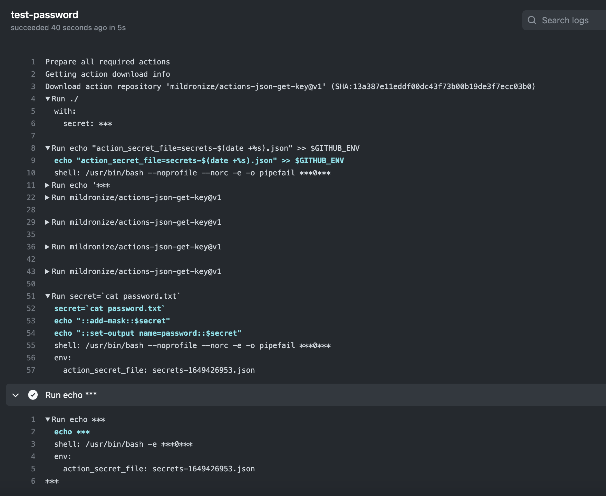

# Get Azure Credential

[](https://github.com/mildronize/actions-get-azure-credential/actions/workflows/test.yml)

Simple GitHub Action Helper to extract Azure Service Principal from secrets

The secrets should be hidden from the log, but it still require to write the secret into file.



## Usage

When you create Azure Credential with:

```bash
az ad sp create-for-rbac -n "my-service-principal-name" --role Contributor --scopes /subscriptions/xxxxxxx
```

it will generate json, the structure of secret:

```json
{
  "appId": "<some-uuid>",
  "displayName": "my-service-principal-name",
  "password": "<some-uuid>",
  "tenant": "<tenant-id>"
}
```

Set the secrets name `Azure_Credential` or name what you want.

### Example

```yaml
steps:
  - name: get azure credential
    id: credential
    uses: mildronize/actions-get-azure-credential@v1
    with:
      secret: ${{ secrets.Azure_Credential }}
  - run: |
      echo App ID: ${{ steps.credential.outputs.app-id }}
      echo Display Name: ${{ steps.credential.outputs.display-name }}
      echo Tenant: ${{ steps.credential.outputs.tenant }}
      echo Password: ${{ steps.credential.outputs.password }}
```
